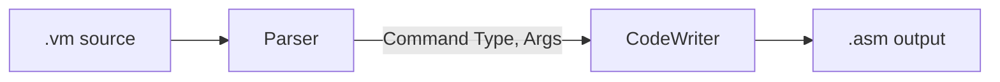

# VMTranslator (C++)

A modular C++ implementation of the **Nand2Tetris VM Translator**, built with CMake.

---

## Build & Run

```bash
mkdir -p build && cd build
cmake ..
cmake --build . -j
```

This produces the executable `vmtranslator` in the `build/` directory.

### Translate a single file

```bash
./vmtranslator path/to/Prog.vm
# => writes path/to/Prog.asm
```

### Translate a directory of `.vm` files (with bootstrap)

```bash
./vmtranslator path/to/ProjectDir
# => writes path/to/ProjectDir/ProjectDir.asm
```

## 💡 作业说明（Assignment）

本项目为 **Nand2Tetris 第 7–8 章** 的课程作业，用于实现一个完整的 **VM → Hack 汇编** 翻译器。

### 学生任务

你需要在提供的挖空版 C++ 代码中完成以下函数的实现（所有空缺以 `/*todo*/` 标记）：

| 模块                 | 主要任务                                    |
| ------------------ | --------------------------------------- |
| `Parser.cpp`       | 读取 `.vm` 文件、去除注释/空行、解析命令类型与参数           |
| `CodeWriter.cpp`   | 将 VM 指令翻译为 Hack 汇编（含算术、内存段访问、流程控制、函数调用） |
| `VMTranslator.cpp` | 在主程序中补齐翻译调度逻辑（区分不同命令类型）                 |

### 建议完成顺序

1. **Parser 模块**（能正确识别每条命令及参数）
2. **算术逻辑命令**：`add`, `sub`, `neg`, `eq`, `gt`, `lt`, `and`, `or`, `not`
3. **内存访问命令**：`push` / `pop` 各段（`local`, `argument`, `this`, `that`, `temp`, `pointer`, `static`, `constant`）
4. **程序流命令**：`label`, `goto`, `if-goto`
5. **函数与调用机制**：`function`, `call`, `return`
6. 支持目录翻译时自动插入 **bootstrap 代码** (`SP=256; call Sys.init`)

---

## 🧠 代码设计思路

整个翻译器采用 **两阶段设计（Parser + CodeWriter）**：



### 1. Parser 模块

* 负责**逐行读取 `.vm` 文件**，跳过注释与空行。
* 将每条命令拆分为 token（命令类型、段名、索引等）。
* 对外暴露：

  * `commandType()`：返回命令类别
  * `arg1()` / `arg2()`：访问当前命令参数

### 2. CodeWriter 模块

* 将 Parser 解析的命令转换为 Hack 汇编指令。
* 内部维护辅助函数：

  * `pushD()` / `popToD()`：处理栈操作
  * `segToD()`：根据段名获取数据
* 支持的主要方法：

  * `writeArithmetic()`：算术逻辑
  * `writePushPop()`：内存访问
  * `writeLabel()` / `writeGoto()` / `writeIf()`：流程控制
  * `writeFunction()` / `writeCall()` / `writeReturn()`：函数调用
* 输出汇编文件流 (`ofstream`)，确保每条命令都有注释说明。

### 3. 主程序 VMTranslator

* 解析输入路径（文件或目录）
* 对每个 `.vm` 文件创建 `Parser`，设置 `CodeWriter` 的当前模块名。
* 顺序调用 `writer.writeXXX()` 完成翻译。
* 若是目录模式，自动插入 bootstrap (`SP=256; call Sys.init`)。

---

## 🧩 框架结构

```
VMTranslator/
├── CMakeLists.txt
├── src/
│   ├── VMTranslator.cpp   # 主程序入口
│   ├── Parser.h / Parser.cpp      # VM 文件解析
│   └── CodeWriter.h / CodeWriter.cpp  # 汇编代码生成
└── README.md              # 当前文档
```

### 类与职责

| 类名                      | 职责描述                 |
| ----------------------- | -------------------- |
| **Parser**              | 解析 VM 文件，按行输出命令类型与参数 |
| **CodeWriter**          | 根据命令类型输出 Hack 汇编     |
| **VMTranslator (main)** | 管理文件输入输出、整体调度逻辑      |